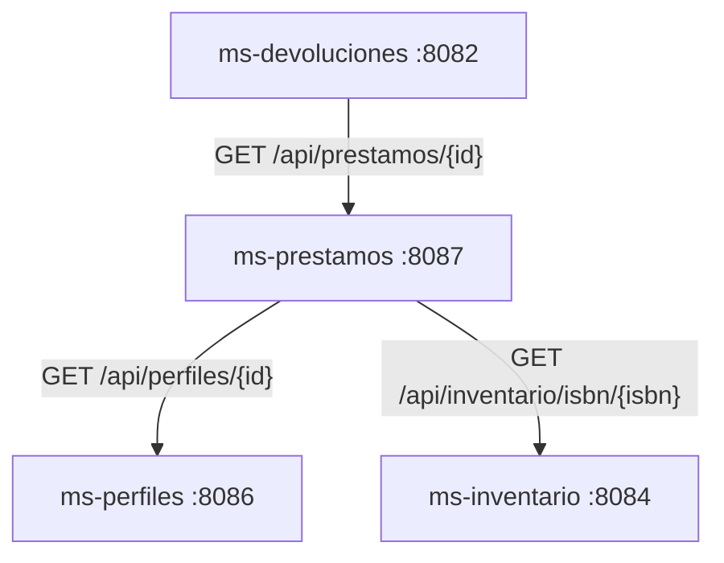

# Sistema de Gestion Bibliotecaria - Hito 2

Sistema de gestion bibliotecaria construido con arquitectura de microservicios, Spring Boot, Docker Compose y MySQL. El proyecto aplica el patron Database per Service: cada microservicio tiene su propia base de datos y no accede directamente a la base de otro servicio.

Repositorio: https://github.com/Maxijrrr/biblioteca-microservicios

---

## Integrantes

| Nombre | Responsabilidad |
|:--|:--|
| Maximiliano Valenzuela | ms-autenticador, ms-catalogo, ms-prestamos |
| Genesis Cerda | ms-perfiles, ms-inventario, ms-devoluciones |
| Vicente Hueichapan | ms-ebooks, ms-penalizaciones, ms-reservas, ms-sucursales |

---

## Estado del Sistema

| Microservicio | Puerto app | Base de datos | Puerto DB local | Responsabilidad |
|:--|:--:|:--|:--:|:--|
| ms-autenticador | 8080 | db_autenticador | 3306 | Registro, login y gestion de credenciales |
| ms-catalogo | 8081 | db_catalogo | 3307 | Catalogo de libros |
| ms-devoluciones | 8082 | db_devoluciones | 3308 | Devoluciones de prestamos |
| ms-ebooks | 8083 | db_ebooks | 3309 | Libros digitales |
| ms-inventario | 8084 | db_inventario | 3310 | Stock por ISBN y sucursal |
| ms-penalizaciones | 8085 | db_penalizaciones | 3311 | Penalizaciones por retrasos o danos |
| ms-perfiles | 8086 | db_perfiles | 3312 | Perfiles de usuarios |
| ms-prestamos | 8087 | db_prestamos | 3313 | Prestamos de libros |
| ms-reservas | 8088 | db_reservas | 3314 | Reservas |
| ms-sucursales | 8089 | db_sucursales | 3315 | Sucursales fisicas |

---

## Arquitectura Database per Service

Cada servicio es dueno exclusivo de su base de datos. La comunicacion entre dominios se realiza por HTTP/REST mediante clientes declarativos Feign, nunca por acceso directo a tablas externas.

```text
ms-autenticador   -> db_autenticador
ms-catalogo       -> db_catalogo
ms-devoluciones   -> db_devoluciones
ms-ebooks         -> db_ebooks
ms-inventario     -> db_inventario
ms-penalizaciones -> db_penalizaciones
ms-perfiles       -> db_perfiles
ms-prestamos      -> db_prestamos
ms-reservas       -> db_reservas
ms-sucursales     -> db_sucursales
```

Docker Compose define 20 contenedores en total: 10 aplicaciones Spring Boot y 10 bases de datos MySQL independientes. Todos se conectan a la red interna `red_interna_proyecto`.

---

## Comunicacion Entre Microservicios

### Flujos implementados con OpenFeign



### Tabla de contratos

| Origen | Destino | Metodo | Endpoint | DTO esperado | Justificacion |
|:--|:--|:--:|:--|:--|:--|
| ms-prestamos | ms-perfiles | GET | `/api/perfiles/{id}` | `PerfilDTO` | Validar que el perfil exista antes de crear un prestamo. |
| ms-prestamos | ms-inventario | GET | `/api/inventario/isbn/{isbn}` | Lista de stock inventario | Validar stock disponible antes de crear un prestamo. |
| ms-devoluciones | ms-prestamos | GET | `/api/prestamos/{id}` | `PrestamoDTO` | Confirmar que el prestamo exista y este `ACTIVO` antes de registrar la devolucion. |

### Configuracion tecnica

| Elemento | Implementacion |
|:--|:--|
| Cliente REST | OpenFeign (`spring-cloud-starter-openfeign`) |
| Descubrimiento en Docker | URLs por nombre de contenedor: `http://ms-servicio:puerto` |
| Timeouts Feign | `connectTimeout=3000ms`, `readTimeout=5000ms` |
| Errores controlados | `@RestControllerAdvice` y excepciones personalizadas |
| Logs | SLF4J en llamadas externas, validaciones y fallos |
| Arranque DB | `healthcheck`, `depends_on: condition: service_healthy` y tolerancia Hikari |

---

## Endpoints Principales Para Hito 2

### Crear perfil

```bash
curl -X POST http://localhost:8086/api/perfil \
  -H "Content-Type: application/json" \
  -d '{"rut":"12345678-9","nombre":"Juan Perez","correo":"juan@duoc.cl","carrera":"Informatica"}'
```

### Crear stock

```bash
curl -X POST http://localhost:8084/api/inventario \
  -H "Content-Type: application/json" \
  -d '{"isbn":"978-3-16","idSucursal":1,"stockTotal":5,"stockDisponible":5}'
```

### Crear prestamo E2E

```bash
curl -X POST http://localhost:8087/api/prestamos/solicitar \
  -H "Content-Type: application/json" \
  -d '{"idPerfil":1,"isbn":"978-3-16"}'
```

Resultado esperado: `ms-prestamos` consulta a `ms-perfiles` y `ms-inventario`; si ambas validaciones son correctas, crea un prestamo con estado `ACTIVO`.

### Crear devolucion E2E

```bash
curl -X POST http://localhost:8082/api/devoluciones \
  -H "Content-Type: application/json" \
  -d '{"idPrestamo":1}'
```

Resultado esperado: `ms-devoluciones` consulta a `ms-prestamos`; si el prestamo existe y esta `ACTIVO`, registra la devolucion.

---

## Pruebas Empiricas Realizadas

Por limitacion de recursos locales, las pruebas se ejecutaron de forma incremental: se levantaron solo los microservicios necesarios para cada escenario y luego se apagaron antes de continuar. Esta estrategia evita sobrecargar el equipo y mantiene las pruebas controladas.

| Area | Estado | Evidencia |
|:--|:--:|:--|
| ms-ebooks + db-ebooks | Probado | Crear, listar, buscar, prestar, devolver y eliminar ebook. |
| ms-catalogo + db-catalogo | Probado | CRUD completo y correccion de tolerancia de arranque DB. |
| ms-inventario + db-inventario | Probado | Crear stock, buscar por ISBN/sucursal, actualizar, eliminar y 404 esperado. |
| ms-sucursales + db-sucursales | Probado | CRUD completo y 404 esperado. |
| ms-penalizaciones + db-penalizaciones | Probado | Crear, buscar por perfil/estado, actualizar, eliminar y 404 esperado. |
| ms-autenticador + db-autenticador | Probado | Registrar, login, consultar perfil, cambiar password y login nuevo. |
| ms-reservas + db-reservas | Probado | Crear, listar, actualizar, eliminar y 404 esperado. |
| Flujo prestamos | Probado | `ms-prestamos -> ms-perfiles` y `ms-prestamos -> ms-inventario`. |
| Flujo devoluciones | Probado | `ms-devoluciones -> ms-prestamos`. |
| Resiliencia inventario caido | Probado | `ms-prestamos` responde HTTP 503 controlado. |
| Resiliencia prestamos caido | Probado | `ms-devoluciones` responde HTTP 503 controlado. |

Logs observados durante el flujo de prestamos:

```text
Consultando ms-perfiles...
Perfil validado correctamente
Consultando ms-inventario...
Stock validado correctamente
Prestamo guardado exitosamente
```

Logs observados durante el flujo de devoluciones:

```text
Consultando ms-prestamos para validar prestamo
Prestamo validado correctamente
```

---

## Ejecucion Local Segura

Para equipos con recursos limitados, no es obligatorio levantar todo el sistema al mismo tiempo. Se recomienda probar por subconjuntos:

```bash
# Ejemplo: probar prestamos con sus dependencias
docker compose up -d --build db-perfiles db-inventario db-prestamos ms-perfiles ms-inventario ms-prestamos

# Ver estado
docker ps

# Apagar el subconjunto probado
docker compose stop ms-prestamos ms-inventario ms-perfiles db-prestamos db-inventario db-perfiles
```

Para levantar todo el sistema en una maquina con recursos suficientes:

```bash
docker compose up -d --build
```

Para apagar todo:

```bash
docker compose down
```

---

## Despliegue En AWS EC2

El proyecto esta documentado para el Escenario A: todos los servicios en una sola instancia EC2 usando Docker Compose.

Recomendacion minima:

- Ubuntu 24.04
- Docker y Docker Compose instalados
- Instancia con memoria suficiente para 20 contenedores
- Puertos abiertos segun necesidad de evaluacion: 8080 a 8089

Comandos base:

```bash
git clone https://github.com/Maxijrrr/biblioteca-microservicios
cd biblioteca-microservicios
docker compose up -d --build
docker ps
```

Si la instancia EC2 es pequena, aplicar la misma estrategia local: levantar solo los subconjuntos requeridos para cada flujo y apagarlos al terminar.

---

## Estructura Del Proyecto

```text
biblioteca-microservicios/
|-- docker-compose.yml
|-- README.md
|-- postman/
|   `-- hito2-integracion.json
`-- codigo-fuente/
    |-- ms-autenticador/
    |-- ms-catalogo/
    |-- ms-devoluciones/
    |-- ms-ebooks/
    |-- ms-inventario/
    |-- ms-penalizaciones/
    |-- ms-perfiles/
    |-- ms-prestamos/
    |-- ms-reservas/
    `-- ms-sucursales/
```

Cada microservicio mantiene la estructura esperada:

```text
controller/
service/
repository/
model/
dto/
exception/
src/main/resources/application.properties
Dockerfile
pom.xml
```

---

## Checklist Hito 2

| Item | Estado |
|:--|:--:|
| 10 microservicios Spring Boot definidos | Cumplido |
| 10 bases de datos MySQL independientes | Cumplido |
| Patron Database per Service | Cumplido |
| Docker Compose con red interna unica | Cumplido |
| Healthchecks para MySQL | Cumplido |
| `depends_on` condicionado por salud de DB | Cumplido |
| DTOs de entrada/salida en los servicios | Cumplido |
| Feign Client en ms-prestamos | Cumplido |
| Feign Client en ms-devoluciones | Cumplido |
| Dos flujos E2E interconectados | Cumplido y probado |
| Timeouts Feign 3000ms/5000ms | Cumplido |
| Manejo global de excepciones | Cumplido |
| Respuestas 404/400/503 controladas | Cumplido |
| Logs SLF4J en llamadas externas | Cumplido |
| README tecnico actualizado | Cumplido |
| Coleccion Postman incluida | Cumplido |
| Pruebas empiricas por subconjuntos | Cumplido |
| Preparado para GitHub y EC2 | Cumplido |

---

## Coleccion Postman

La coleccion de pruebas se encuentra en:

```text
postman/hito2-integracion.json
```

Incluye endpoints para CRUD y pruebas E2E de comunicacion entre servicios.

---

## Notas De Ingenieria

- El sistema evita compartir bases de datos entre microservicios.
- Los servicios se comunican por APIs internas, no por tablas externas.
- Las URLs externas se inyectan con variables de entorno desde Docker Compose.
- Se agrego tolerancia de conexion Hikari para evitar fallos por arranque lento de MySQL.
- Las pruebas locales se realizaron por subconjuntos para proteger recursos del equipo.
- En EC2 se puede repetir la misma estrategia o levantar todo si la instancia tiene memoria suficiente.

---

Desarrollo FullStack 1 - DSY1103 - Duoc UC 2026
